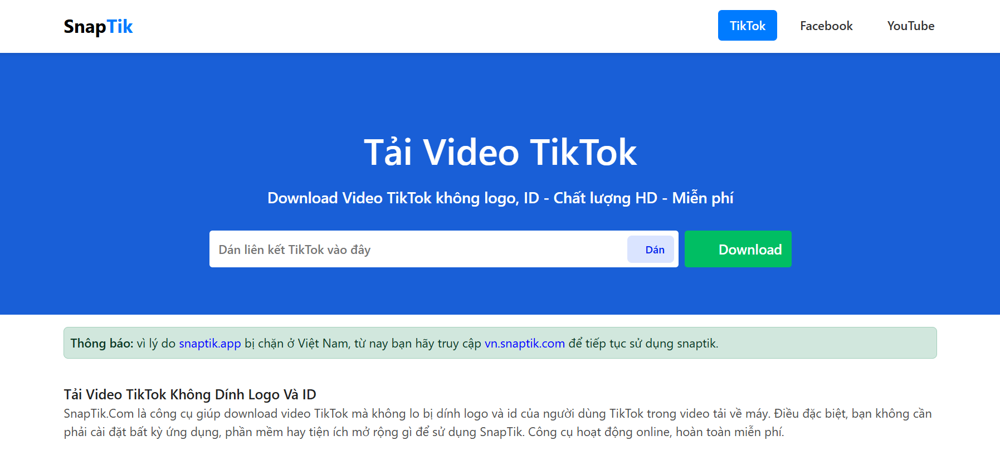
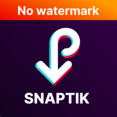

## Tổng quan
SnapTok là một website trực tuyến cho phép tải video từ TikTok, Facebook và YouTube với chất lượng cao, hoàn toàn miễn phí. Công cụ hỗ trợ tải video TikTok không có logo, video Facebook và YouTube ở nhiều định dạng và độ phân giải khác nhau.

## Tính năng
- **Tải video TikTok**: Tải video TikTok không có logo hoặc watermark, chất lượng HD (định dạng MP4). Hỗ trợ trích xuất âm thanh (MP3).
- **Tải video Facebook**: Tải video công khai từ Facebook ở chất lượng SD hoặc HD (định dạng MP4).
- **Tải video YouTube**: Tải video YouTube với nhiều độ phân giải (360p, 720p, 1080p) và định dạng (MP4, MP3).
- **Tương thích đa nền tảng**: Hoạt động trên mọi thiết bị như PC, iOS, Android mà không cần cài đặt phần mềm bổ sung.
- **Miễn phí và không cần đăng nhập**: Sử dụng hoàn toàn miễn phí, không yêu cầu tài khoản.
- **Giao diện thân thiện**: Thiết kế đơn giản, responsive, dễ sử dụng trên cả máy tính và điện thoại.

## Công nghệ sử dụng
- **Frontend**:
  - HTML5, CSS3, JavaScript (Vanilla JS và jQuery)
  - Thiết kế responsive với media queries để tương thích với thiết bị di động
  - DOMPurify để làm sạch nội dung HTML, tránh XSS
- **Backend**:
  - PHP để xử lý logic phía server (ví dụ: xử lý URL video Facebook)
  - cURL để gửi yêu cầu HTTP và trích xuất metadata video
- **API**:
  - TikTok: Sử dụng API `https://tikwm.com/api/` để lấy dữ liệu video TikTok
  - YouTube: Sử dụng API `https://vkrdownloader.xyz/server` để lấy metadata và link tải video
  - Facebook: Tự xây dựng cơ chế scraping bằng cURL để trích xuất link video SD/HD
- **Thư viện bên ngoài**:
  - jQuery (v3.7.1) để xử lý DOM và AJAX
  - DOMPurify (v3.2.3) để đảm bảo an toàn nội dung

## Ảnh demo

## Logo ứng dụng

## Cách hoạt động
1. **TikTok**:
   - Người dùng dán URL video TikTok vào ô nhập liệu.
   - Gửi yêu cầu tới API `tikwm.com` để lấy link tải video (không logo, có logo, hoặc âm thanh).
   - Hiển thị preview video, thumbnail và các nút tải xuống (MP4, MP3).
2. **Facebook**:
   - Người dùng dán URL video Facebook công khai.
   - PHP sử dụng cURL để gửi yêu cầu HTTP, trích xuất link SD/HD từ HTML trả về.
   - Hiển thị preview video và các nút tải xuống theo chất lượng.
3. **YouTube**:
   - Người dùng dán URL video YouTube.
   - JavaScript gửi yêu cầu AJAX tới API `vkrdownloader.xyz` để lấy metadata và link tải.
   - Hiển thị thumbnail, tiêu đề, mô tả và các nút tải xuống (MP4, MP3) với các chất lượng khác nhau.

## Cài đặt
1. Clone repository: `git clone <repo-url>`
2. Đặt repository trên server hỗ trợ PHP (Apache/Nginx).
3. Cấu hình quyền truy cập cho thư mục `static` và `css`.
4. Đảm bảo server hỗ trợ cURL và cho phép gửi yêu cầu HTTP đến các API bên ngoài.

## Hướng dẫn sử dụng
1. Mở trang web SnapTok tại [http://snaptok.free.nf](https://snaptok.free.nf).
2. Chọn nền tảng (TikTok, Facebook, YouTube) từ menu điều hướng.
3. Dán URL video vào ô nhập liệu và nhấn "Download".
4. Chọn chất lượng/định dạng mong muốn và tải video về thiết bị.

## Lưu ý
- Chỉ hỗ trợ tải video công khai.
- Không lưu trữ video trên server; các link tải được xóa ngay sau khi xử lý.
- Không sử dụng video tải về cho mục đích thương mại mà không có sự cho phép.
- SnapTok không liên kết với TikTok, Facebook, YouTube hoặc các công ty liên quan.

## Bảo mật
- Sử dụng DOMPurify để ngăn chặn tấn công XSS.
- Không yêu cầu thông tin cá nhân hay đăng nhập.
- Các yêu cầu API được gửi qua HTTPS để đảm bảo an toàn.

## Giấy phép
© 2019 - 2023 SnapTok. Đọc thêm tại [Điều khoản dịch vụ](terms-of-service.html) và [Chính sách bảo mật](privacy-policy.html).
